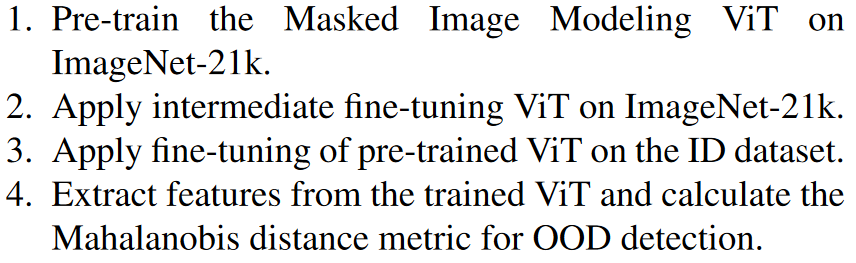

论文名称：Rethinking Out-of-distribution (OOD) Detection: Masked Image Modeling is All You Need

地址：[论文地址](https://openaccess.thecvf.com/content/CVPR2023/html/Li_Rethinking_Out-of-Distribution_OOD_Detection_Masked_Image_Modeling_Is_All_You_CVPR_2023_paper.html)

发表：CVPR 2023

日期：2023/5/31

分类：Out-of-distribution (OOD) Detection

=======

【summary】

本文的出发点是根据在对抗攻击领域的一些研究，使用判别式方法（比如分类任务）进行预训练通常使得模型学到一种捷径解，而没有真正地学习到In Distribution(ID)的分布。因此，本文使用重建的生成式方法对模型进行预训练，从而学到In Distribution的像素级别的模式，为进行异常检测提供参考。

【points】

本文提出的算法的主要流程为：

首先在ImageNet21k上做掩码学习（类似于BEiT的tokenizer的方式），然后在ImageNet21k做分类的微调（称之为intermediate fine-tuning），最后使用label smoothing的方式在目标数据集上进行微调。关于为什么使用label smoothing，作者给出的解释是

我之前有个疑问是既然是做异常检测，那么类别应该只有两类：异常与正常，而在训练过程中既然只能见到正常样本，那么类别只有一个，这种情况下怎么做微调呢？我猜测，作者进行微调的时候是使用的数据集（cifar10、cifar100、imagenet30)的物体类别标签，而不是正常/异常的标签。

作者分别进行了One-Class OOD Detection与Multi-Class OOD Detection，one是指使用单个数据集的一类作为ID，其他类别为OOD；mulit是指一个数据集的多个类别作为ID，其他数据集的多个类别作为OOD。除此之外，还有Near-Distribution OOD Detection（不懂）与OOD Detection with Outlier Exposure（指训练的时候能看到一些异常样本）。

以上算法的三个训练过程缺一不可，如图：

【unknown】

不知道Near-Distribution OOD Detection是什么任务

【ideas】

这个工作说实话有点简单，可能简单的工作也有简单工作的魅力吧，易于follow，或者是简单的idea能够深入人心或者具有启发性。
