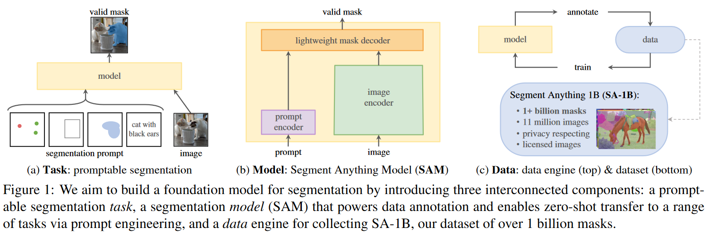

论文名称：Segment Anything

地址：[论文地址](http://arxiv.org/abs/2304.02643)

发表：Arxiv

日期：2023/5/23

=======

【summary】

本文介绍了一个称之为SAM的基础模型（foundation models），并公布了新的目前最大的图像分割数据集SA-1B。具体有以下几点：

1. task：提出了称之为“promptable segmentation”的任务，根据提示分割出目标物体，提示的种类包括提示点、目标框、粗粒度的mask、或者是文本描述。

2. model：SAM的网络模型是很简单的，包含image encoder、prompt encoder和轻量化的mask decoder。image encoder使用MAE预训练的ViT，prompt encoder则根据prompt的不同而不同，mask decoder中使用self-attention和cross-attention来更新两种embeddings并解码出最终输出。

3. data：本文详细介绍了一种“data engine"用于标注互联网图片数据集，包含三个阶段：人工+人机+全自动。本文还详细分析了数据集的各种属性。

4. zero-transfer：本文希望所提出的SAM模型能够和CLIP一样用在各种zero/few-shot任务上。

   

【ideas】

可以尽快尝试使用此模型做一些zero/few-shot的任务，时间不等人。