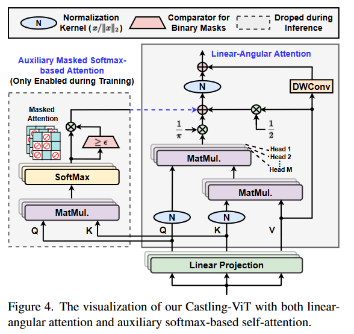
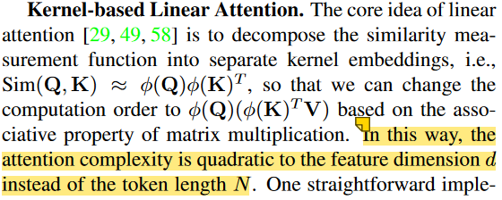
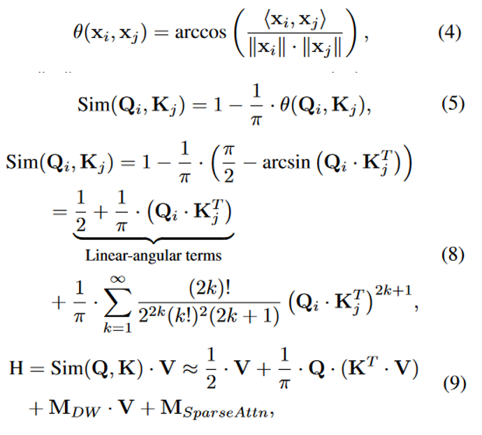
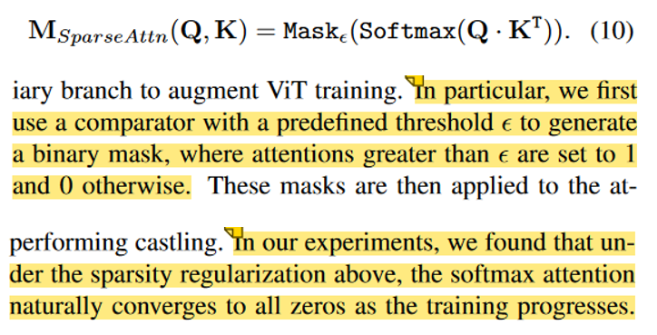

论文名称：Castling-ViT: Compressing Self-Attention via Switching Towards Linear-Angular Attention at Vision Transformer Inference

地址：[论文地址](https://openaccess.thecvf.com/content/CVPR2023/html/You_Castling-ViT_Compressing_Self-Attention_via_Switching_Towards_Linear-Angular_Attention_at_Vision_CVPR_2023_paper.html)

发表：CVPR 2023

日期：2023/5/29

分类：transformer架构

=======

【summary】

本文针对解决传统ViT对input token长度N的二次复杂度的问题，提出了一种线性解决方案。该方法首先提出了一种新的Linear-Angular Attention用于拟合注意力计算函数中的线性项，并额外使用一个Auxiliary Masked Softmax based Attention来拟合剩下的高阶项。在推理阶段，高阶项被舍弃，因此整个网络最终变成相对N线性的复杂度。

【points】

本文的一个核心概念是Kernel-based Linear Attention

在线性模块Linear-Angular Attention的推导中，作者首先定义了一种基于余弦距离的相似度衡量方式，之后对此函数做函数展开，最终得到线性项的计算方式

在高阶项模块中，作者对其输出做了一个基于阈值的mask。实验结果显示，随着训练的进行，此模块的输出会逐渐收敛于0（也就是说模块的输出会收敛于阈值之下），这也就自然而然地达到了丢弃这个高阶项的目的。作者发现收敛不受阈值大小的影响，即使阈值设置成0.02也会收敛到零。

【unknown】

Kernel-based Linear Attention的复杂度的推导可以自己试试

【ideas】

其实我感觉本文的模型太复杂了，很难follow。

用Taylor展开来近似拟合的方法可以学习学习

本文提到的mask自动收敛的现象挺有意思的。我之前想作者丢弃的方式可能是想PG-GAN一样对两个分支设置权值，然后在训练的过程中不断降低要被丢弃的那个分支的权重直到零，最终丢弃掉。而这个论文告诉我模型能够自动收敛到被丢弃，很神奇。
