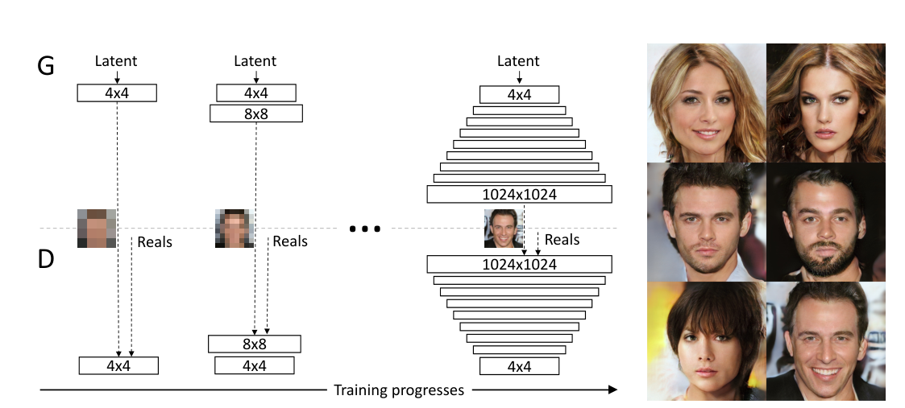
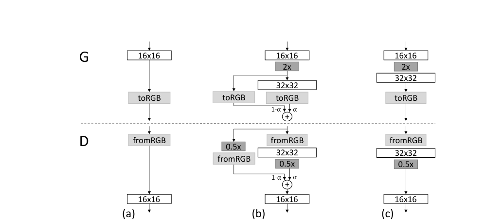
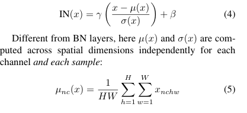
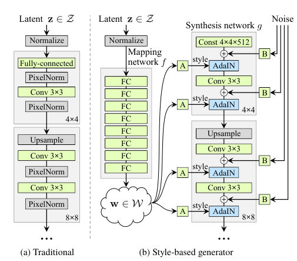
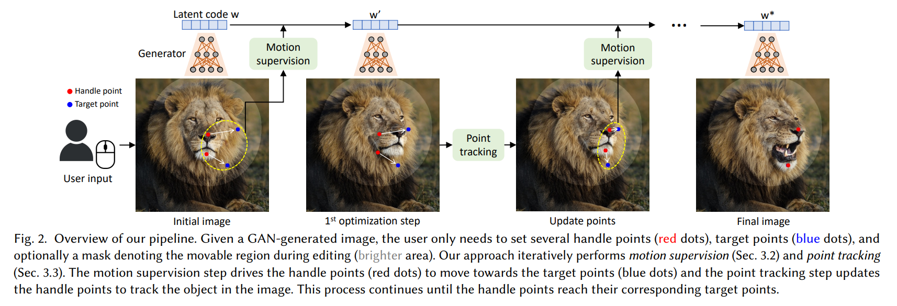
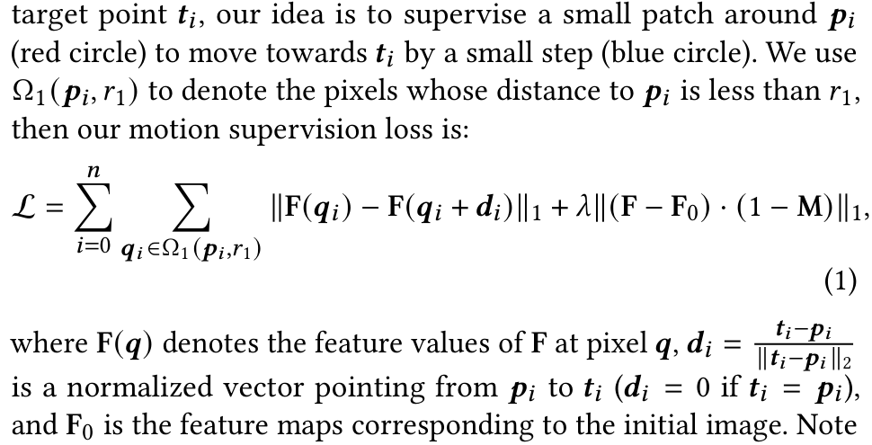

论文名称：Drag Your GAN: Interactive Point-based Manipulation on the Generative Image Manifold

地址：[论文地址](https://arxiv.org/abs/2305.10973)

发表：SIGGRAPH 2023

日期：2023/5/28

分类：GANs

=======

【前置知识】

“包括PG-GAN、AdaIN、StyleGAN”

1. PG-GAN：为了解决GAN生成图片分辨率低以及训练不稳定的问题，提出了一种通过多阶段的训练逐渐增加GAN生成图片分辨率的方式，在每一阶段中，为了避免新增加的网络层带来的不稳定，增加了旁支的残差连接，随着训练的进行，残差旁支的权重逐渐减小至零，最终将旁支舍弃完成此阶段的训练。

   

   

2. AdaIN：AdaIN将图片（各通道）的均值与方差视为一个图片的风格，将图片X的均值与方差改为图片Y的均值与方差即完成了风格迁移。

   

3. StyleGAN：将PG-GAN与AdaIN融合，噪声提供图片内容，而训练图片提供图片风格。在PG-GAN的不同层次上，提供低层次风格的图片（分辨率低）能够控制整体的风格，提供高层次风格的图片（分辨率高）能控制细节的风格。

   

【DragGAN】

首先给出模型示意图以及“Drag”的演示

DragGAN在GAN的基础上主要是增加了两个组件，一个是Motion Supervision，另一个是Point Tracking。Motion Supervision将起始点沿目标点的方向移动一段距离，并对移动前后位置上特征图的差别进行L1范数监督。使用更改后的特征图生成图片便是“drag”图片后的结果。Point Tracking则基于最近邻搜索找到移动后根据特征图生成的图像中原起始点的新位置。

